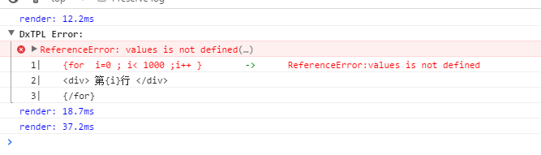

# DXTemplate JS
Js的网页模板库，Web方面的轮子之一，不足5kb,实现了 if,while,for,each,include等基本功能
，提供了一个可视化的Debug(控制台查看)。

## 可视化Debug


## 支持语法
### Js-if

```
{if exp}   
//...
{else if exp}
//...
{else}
...
{/if}
```

### each 
*Array*
```
{ each  obj as item}
{/each}
```
*Object*
```
{ each  obj as name:item}
{/each}
```
### Js-while
```
{while exp}
{/while}
```
### Js-For 
```
{for exp}
{/for}
```

### include
```
{include "template-id" }
```

# Lisence MIT
